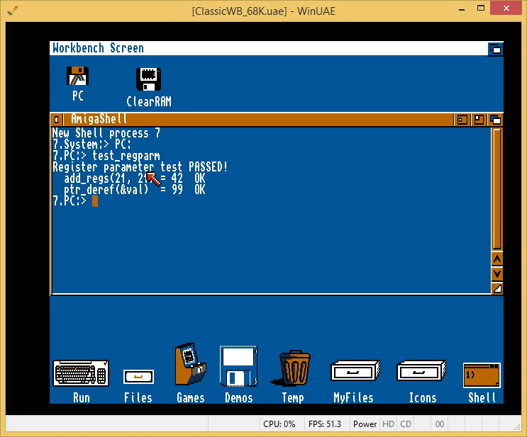

# amiga-regparm-test

A minimal AmigaOS CLI program to verify `asm("reg")` / `__asm__("reg")` register parameter support in the [m68k-amiga-elf GCC toolchain](https://github.com/BartmanAbyss/vscode-amiga-debug) (BartmanAbyss/vscode-amiga-debug).

This test was written as part of the development of [gcc-regparm.patch](https://github.com/jbilander/vscode-amiga-debug/blob/master/gcc-regparm.patch), a patch that adds register parameter calling convention support to the Bartman toolchain's GCC 15.1.

## What it tests

Two functions using explicit register parameter constraints:

```c
/* Data register parameters — expected codegen: add.l d1,d0 / rts */
static long add_regs(long a asm("d0"), long b asm("d1"))
{
    return a + b;
}

/* Address register parameter — expected codegen: move.l (a0),d0 / rts */
static long ptr_deref(long *p asm("a0"))
{
    return *p;
}
```

When the patch is applied correctly, `add_regs` compiles to a single `add.l d1,d0` instruction with no stack involvement, and `ptr_deref` to a single `move.l (a0),d0`. The caller places arguments directly into the named registers rather than pushing them onto the stack.

## Verified working in WinUAE



## Prerequisites

- Patched `m68k-amiga-elf-gcc` 15.1 with `gcc-regparm.patch` applied  
  → see [jbilander/vscode-amiga-debug](https://github.com/jbilander/vscode-amiga-debug)
- `elf2hunk` built from [BartmanAbyss/elf2hunk](https://github.com/BartmanAbyss/elf2hunk)
- `m68k-amiga-elf-objdump` (from the binutils build)
- AmigaOS NDK headers (NDK 3.2 or 3.9) — only needed if you modify the program to use `proto/` headers

> **Note:** The program uses direct inline asm wrappers for all exec/dos library calls instead of the NDK `proto/` headers. This is necessary because the NDK 3.2 inline stubs generate incorrect code (`jsr (a0)` instead of `jsr -N(a6)`) when compiled with GCC 15.x. The direct inline asm approach is reliable across all GCC versions.

## Building

```bash
# Use default NDK path (not needed for this program but kept for reference)
make

# Clean
make clean
```

The Makefile produces:
- `test_regparm` — AmigaOS hunk executable (copy to Amiga/WinUAE)
- `test_regparm.elf` — ELF intermediate (for debugging with objdump)
- `test_regparm.s` — disassembly of the ELF

## Running

Copy `test_regparm` to your Amiga or WinUAE and run from the shell:

```
test_regparm
```

Expected output:

```
Register parameter test PASSED!
  add_regs(21, 21) = 42  OK
  ptr_deref(&val)  = 99  OK
```

## Background

The Bartman/Abyss vscode-amiga-debug toolchain uses a stock GCC m68k calling convention where all function arguments are passed on the stack. This patch adds support for the AmigaOS register parameter convention used by vbcc, SAS/C, and Bebbo's amiga-gcc, enabling declarations like:

```c
void DevOpen(struct Library    *dev   asm("a6"),
             struct IORequest  *ioreq asm("a1"),
             ULONG              unit  asm("d0"),
             ULONG              flags asm("d1"));
```

This is essential for writing AmigaOS device drivers and library stubs that must conform to the Amiga ROM calling convention.

## Related

- [jbilander/vscode-amiga-debug](https://github.com/jbilander/vscode-amiga-debug) — fork containing `gcc-regparm.patch`
- [BartmanAbyss/vscode-amiga-debug](https://github.com/BartmanAbyss/vscode-amiga-debug) — original toolchain
- [jbilander/SimpleDevice](https://github.com/jbilander/SimpleDevice) — Amiga device driver using register parameters
